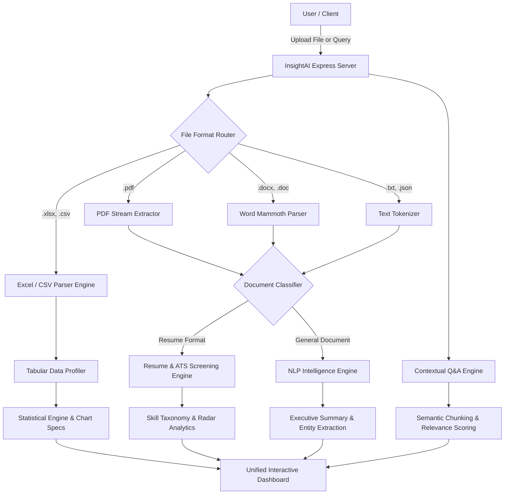

# 🧠 InsightAI — AI Document Intelligence & Data Analytics Platform

[](https://nodejs.org)
[](https://expressjs.com)
[](https://www.chartjs.org)
[](LICENSE)
[]()

> **InsightAI** is a high-performance full-stack platform engineered to analyze **Excel, CSV, PDF, DOCX, and Text** files, extracting structured insights, automated visualizations, and intelligent summaries. Featuring domain-tuned AI/NLP pipelines for **resume screening, ATS matching, key information extraction, and natural language document Q&A**.

---

## 🌟 Key Highlights & Capabilities

### 1. 📂 Multi-Format Ingestion & File Parsing Pipeline
- **Excel & CSV (`.xlsx`, `.xls`, `.csv`)**: Automatic multi-sheet detection, cell formatting normalization, schema inference, and JSON record streaming.
- **PDF Documents (`.pdf`)**: Native text stream extraction, page chunking, metadata extraction, and fallback parsing.
- **Word Documents (`.docx`, `.doc`)**: Hierarchical heading and paragraph extraction via Mammoth engine.
- **Text & JSON (`.txt`, `.md`, `.json`)**: Zero-overhead parsing with word, token, and character counting.

### 2. 📊 Tabular BI & Statistical Profiler
- **Automated Descriptive Profiling**: Computes mean, median, min, max, standard deviation, quartiles ($Q_1$, $Q_3$), and IQR metrics.
- **Anomaly & Outlier Detection**: Statistical outlier identification across numerical series.
- **Dynamic Visualizations**: Auto-generates time-series line trends, categorical distribution bar charts, and histogram bins using Chart.js.
- **Data Quality Score**: Calculates completeness index and distinct value ratios per column.

### 3. 🎯 AI Resume Screening & ATS Ranking
- **Multi-Category Skill Taxonomy**: Classifies skills into *Programming Languages*, *Frameworks*, *Cloud & DevOps*, *Databases*, *AI/ML*, and *Soft Skills*.
- **ATS Match Score Algorithm (0-100%)**: Weighted alignment against custom Job Descriptions:
  - Technical Competence ($40\%$)
  - Role & Experience Depth ($25\%$)
  - Education & Certification ($15\%$)
  - Skill Diversity ($20\%$)
- **Competency Radar Chart**: Compares candidate profile against industry senior engineering benchmarks.
- **Requisition Gaps & Recommendations**: Highlights missing critical keywords and candidate differentiators.

### 4. 📝 Document Summarization & Contextual Q&A
- **Executive Summaries**: High-density synopsis, bulleted key takeaways, and strategic milestones.
- **Action Item Extraction**: Identifies imperative deliverables, timelines, and commitments.
- **Financial & Operational Metric Extraction**: Isolates currencies, percentages, and growth targets with context snippets.
- **Named Entity Recognition (NER)**: Detects Organizations, Technologies, Dates, and Geographic locations.
- **Ask InsightAI**: Semantic document Q&A engine returning direct answers with confidence scores and source citations.

### 5. ⚡ REST API & Interactive Developer Console
- Live in-browser API explorer with sample payloads, cURL generators, and latency monitors.

---

## 🏗️ Architecture & Processing Workflow



---

## 📁 Repository Structure

```
InsightAI/
├── package.json                 # Project dependencies & startup scripts
├── .gitignore                   # Excluded build artifacts and node_modules
├── README.md                    # Comprehensive documentation & guide
├── server/
│   ├── index.js                 # Express server & static asset serving
│   ├── parsers/
│   │   └── fileParser.js        # Multi-format parsing pipeline (Excel, PDF, DOCX, TXT)
│   ├── analyzers/
│   │   ├── dataProfiler.js      # Statistical profiling & Chart.js generation
│   │   ├── nlpEngine.js         # Summarization, NER, metrics, & sentiment
│   │   ├── resumeScreening.js   # ATS match engine, skills taxonomy, & radar specs
│   │   └── qaEngine.js          # Contextual document Q&A with citations
│   └── routes/
│       └── api.js               # RESTful endpoints & Swagger-style docs
├── public/
│   ├── index.html               # Main single-page application dashboard
│   ├── css/
│   │   └── style.css            # Modern dark-mode glassmorphic design system
│   └── js/
│       ├── app.js               # Application state, drag-drop, & UI controllers
│       ├── charts.js            # Chart.js visualizer wrapper
│       └── samples.js           # Instant demo workflow loaders
├── samples/
│   ├── q3_financial_metrics.csv # Sample enterprise financial dataset
│   ├── senior_ai_engineer_resume.txt # Sample senior AI engineer resume
│   └── cloud_ai_strategy_memo.txt    # Sample executive strategic memo
└── scripts/
    ├── init-git.js              # Local git repository initializer
    └── push-to-github.js        # Automated GitHub push utility
```

---

## 🚀 Quick Start Guide

### Prerequisites
- [Node.js](https://nodejs.org/) v18.0.0 or higher
- [npm](https://www.npmjs.com/) v9.0.0 or higher

### 1. Clone or Open the Repository
```bash
git clone https://github.com/Prasannaraj2k5/InsightAI.git
cd InsightAI
```

### 2. Install Dependencies
```bash
npm install
```

### 3. Launch InsightAI Server
```bash
npm start
```
*Access the dashboard at `http://localhost:3000`.*

---

## 📡 REST API Reference

| Method | Endpoint | Description | Payload / Params |
|---|---|---|---|
| `POST` | `/api/upload` | Upload & auto-analyze any supported file | `multipart/form-data` (`file`, `jobDescription`) |
| `POST` | `/api/analyze/document` | Direct NLP summarization, NER & metrics | `{ "text": "string" }` |
| `POST` | `/api/analyze/data` | Tabular data profiling & chart generation | `{ "data": [{ ... }] }` |
| `POST` | `/api/analyze/resume` | ATS candidate scoring & skill extraction | `{ "resumeText": "...", "jobDescription": "..." }` |
| `POST` | `/api/query` | Natural language document Q&A | `{ "documentText": "...", "question": "..." }` |
| `GET` | `/api/samples/:name` | Fetch pre-bundled sample dataset | `:name` (`financial`, `resume`, `strategy_memo`) |
| `GET` | `/api/health` | Health check & system uptime | None |
| `GET` | `/api/docs` | Interactive API schema | None |

### Example: Querying a Document via cURL
```bash
curl -X POST http://localhost:3000/api/query \
  -H "Content-Type: application/json" \
  -d '{
    "documentText": "InsightAI cuts operational cost by $14.6M and achieves 98.4% accuracy across financial documents.",
    "question": "What is the accuracy rate?"
  }'
```

---

## 💻 Pushing Updates to GitHub

To push commits directly to `https://github.com/Prasannaraj2k5/InsightAI`:
```bash
# Push using GitHub Personal Access Token (or GITHUB_TOKEN env variable)
GITHUB_TOKEN="your_personal_access_token" npm run push
```
Or use standard Git:
```bash
git remote add origin https://github.com/Prasannaraj2k5/InsightAI.git
git branch -M main
git push -u origin main
```

---

## 📄 License
This project is licensed under the [MIT License](LICENSE).

---
*Created by [Prasanna Raj](https://github.com/Prasannaraj2k5).*
